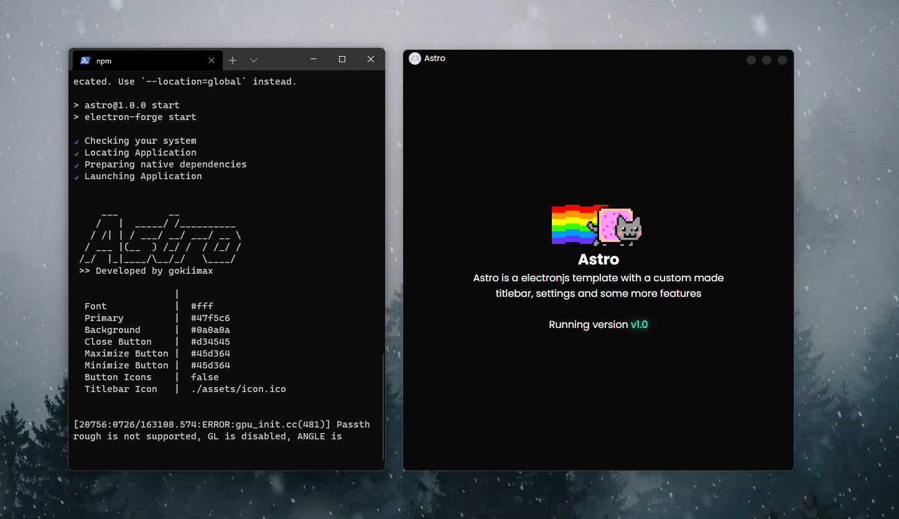

Astro is a minimialist electronjs template with a custom made titlebar, settings and some more features coming in the future
<p align="center">
	<a href="https://discord.gg/yVWygKS3Xn">
		
	</a>
</p>

## Install
Cloe the repository and install dependencies:
```bash
git clone https://github.com/DevKing472/Electron-Astro.git
cd Astro
npm install
```

## Starting Development
Start the demo app
```bash
npm start
```
or start editing the index.js file in `./src/`

## Packaging
To package apps for your platform:
```bash
npm run package
```

## Docs
Documentation are coming soon!


